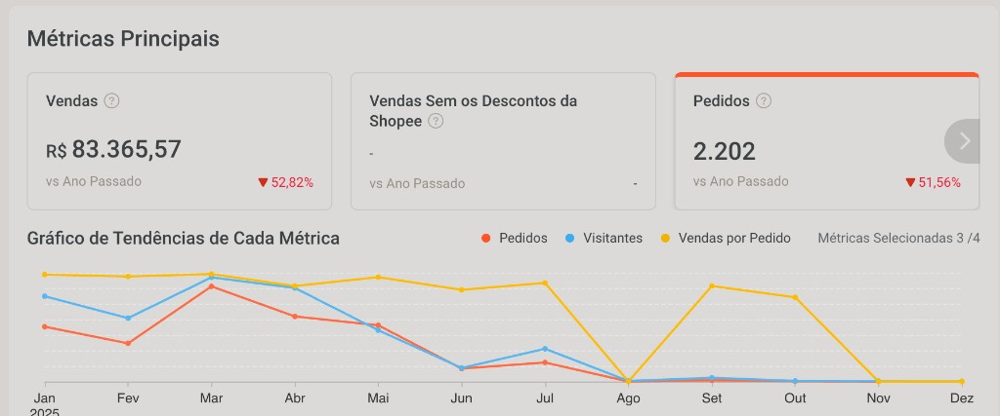

# Processador de PDF para etiquetas (Shopee → impressora térmica)

Ferramenta web que divide cada página de um PDF em **quatro quadrantes**, gerando **uma etiqueta por página**. Foi criada para uso real em loja na **Shopee**, onde o arquivo de envio vem com **quatro etiquetas na mesma folha** — formato que não conversa bem com fluxos de impressão em **impressora térmica** (ex.: Zebra e similares), que esperam **uma etiqueta por impressão/página**.

## Por que este projeto existe

Na operação do dia a dia, imprimir direto o PDF da Shopee na térmica era impraticável: a página agrupa **4 etiquetas em quadrantes**. Cortar manualmente ou redimensionar página a página não escala quando o volume de pedidos cresce.

Este programa **recorta automaticamente** cada quadrante, descarta quadrantes vazios (quando aplicável) e devolve um PDF em que **cada página é uma única etiqueta**, pronta para enviar à impressora térmica.

### Contexto da loja (volume que justifica a automação)

A captura abaixo é o painel **Métricas principais** da loja na Shopee (período anual), com **faturamento** e **pedidos** — ordem de grandeza que torna inviável tratar cada PDF de etiquetas só “no braço”.

*No print: resumo com vendas e pedidos no ano e o gráfico de tendências ao longo dos meses (pedidos, visitantes, vendas por pedido). Os valores exatos podem mudar com o tempo; a imagem documenta o contexto operacional no momento da captura.*

## Como funciona (técnico)

1. O PDF de entrada é rasterizado página a página (PyMuPDF / `fitz`).
2. Cada página é dividida em **4 retângulos** (superior esquerdo, inferior esquerdo, superior direito, inferior direito).
3. Quadrantes muito claros são tratados como **em branco** e ignorados (heurística por média de luminosidade).
4. Cada quadrante válido vira uma **nova página** no PDF de saída.

Código principal: `api.py` (`process_pdf`, `divide_into_quadrants`, `is_image_blank`).

## Uso local (interface)

1. Abra `index.html` no ambiente servido (ex.: deploy na Vercel ou servidor estático local).
2. Envie o PDF exportado da Shopee (ou qualquer PDF com o mesmo layout de 4 etiquetas por página).
3. Baixe o `processed.pdf` com **uma etiqueta por página**.

## Deploy (Vercel)

O repositório inclui `vercel.json` com build da função Python (`api.py`) e arquivos estáticos. Dependências: `requirements.txt` (`pymupdf`, `pillow`).

## Requisitos

- Python 3 (na Vercel, conforme runtime do builder `@vercel/python`)
- Pacotes listados em `requirements.txt`

## Licença e aviso

Uso conforme a necessidade da sua operação. Valide sempre uma amostra do PDF gerado antes de imprimir em lote, pois mudanças no layout oficial das etiquetas da Shopee podem afetar o recorte.
